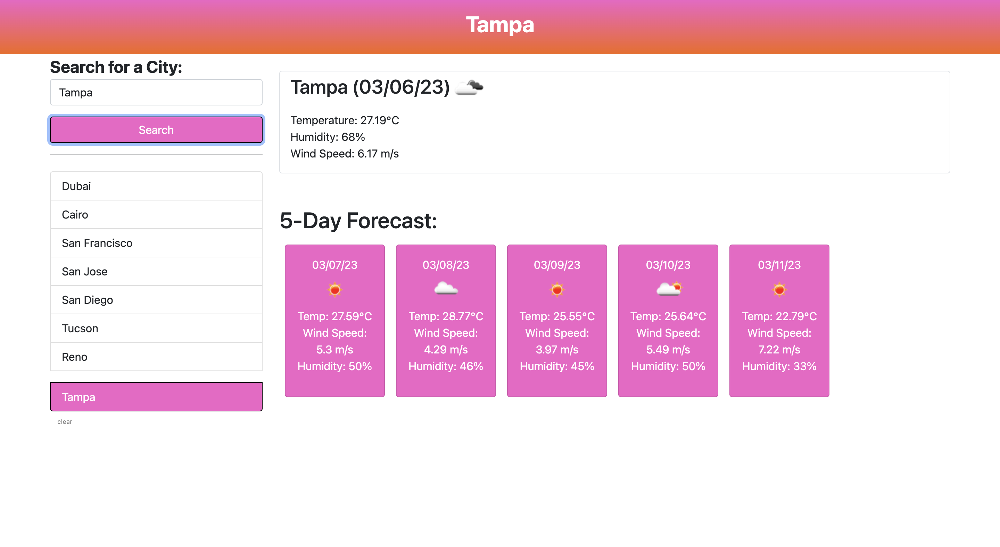

# Server-Side APIs: Weather Dashboard

## Application Description

Third-party APIs allow developers to access their data and functionality by making requests with specific parameters to a URL. Developers are often tasked with retrieving data from another application's API and using it in the context of their own. This challenge is to build a weather dashboard that will run in the browser and feature dynamically updated HTML and CSS. The application features a search option for a specific city along with a list of cities from the search history. The weather dashboard will also feature a five day weather forecast and current weather conditions for a given city.

The [5 Day Weather Forecast](https://openweathermap.org/forecast5) is used to retrieve weather data for cities.

`localStorage` is used to store any persistent data. For more information on how to work with the OpenWeather API, refer to the [Full-Stack Blog on how to use API keys](https://coding-boot-camp.github.io/full-stack/apis/how-to-use-api-keys).

## User Story

```
AS A traveler
I WANT to see the weather outlook for multiple cities
SO THAT I can plan a trip accordingly
```

## Acceptance Criteria

```
GIVEN a weather dashboard with form inputs
WHEN I search for a city
THEN I am presented with current and future conditions for that city and that city is added to the search history
WHEN I view current weather conditions for that city
THEN I am presented with the city name, the date, an icon representation of weather conditions, the temperature, the humidity, and the wind speed
WHEN I view future weather conditions for that city
THEN I am presented with a 5-day forecast that displays the date, an icon representation of weather conditions, the temperature, the wind speed, and the humidity
WHEN I click on a city in the search history
THEN I am again presented with current and future conditions for that city
```

## Pseudo Code for HTML
* Header with title for weather dashboard.
* Left-hand side: search bar to search for a specific city along with a list of cities from the search history.
* Main body that consists of two sections:
    1) Top section includes the name of the city, the current date, and weather stats (temperature, precipitation, humidity, wind) for the current day.
    2) Bottom section includes a five day weather forecast of said city.

## Pseudo Code for CSS
* Style for the header.
* Font styling for the title and the weather stats.
* Background color for the main body.
* Color for the search bar and the list of cities.
* Color for the five day weather forecast.

## Pseudo Code for JavaScript
* Create a function that will retrieve the weather stats for the current day.
    1) Use the [5 Day Weather Forecast](https://openweathermap.org/forecast5) to retrieve weather data for cities.
    2) Create a variable that will store the current date.
    3) Create a variable that will store the name of the city.
    4) Create a variable that will store the temperature.
    5) Create a variable that will store the humidity.
    6) Create a variable that will store the wind speed.
* Create a function that will retrieve the weather stats for the five day forecast.
* Create a function that will retrieve the weather stats for the search history.
* Create a function that will retrieve the weather stats for the search bar.
* Create a function that will retrieve the weather stats for the list of cities.

## Mock-Up

The following image shows the web application's appearance and functionality:



URL to deployed application:
https://kaitlynatif.github.io/Weather_Forecast_Dashboard/

URL to GitHub repository:
https://github.com/kaitlynatif/Weather_Forecast_Dashboard/

For any questions, please contact me at kaitlynatif90@hotmail.com

## License

MIT License

Copyright (c) [2023] [Kaitlyn Atif]

Permission is hereby granted, free of charge, to any person obtaining a copy of this software and associated documentation files (the "Software"), to deal in the Software without restriction, including without limitation the rights to use, copy, modify, merge, publish, distribute, sublicense, and/or sell copies of the Software, and to permit persons to whom the Software is furnished to do so, subject to the following conditions:

The above copyright notice and this permission notice shall be included in all copies or substantial portions of the Software.

THE SOFTWARE IS PROVIDED "AS IS", WITHOUT WARRANTY OF ANY KIND, EXPRESS OR IMPLIED, INCLUDING BUT NOT LIMITED TO THE WARRANTIES OF MERCHANTABILITY, FITNESS FOR A PARTICULAR PURPOSE AND NONINFRINGEMENT. IN NO EVENT SHALL THE AUTHORS OR COPYRIGHT HOLDERS BE LIABLE FOR ANY CLAIM, DAMAGES OR OTHER LIABILITY, WHETHER IN AN ACTION OF CONTRACT, TORT OR OTHERWISE, ARISING FROM, OUT OF OR IN CONNECTION WITH THE SOFTWARE OR THE USE OR OTHER DEALINGS IN THE SOFTWARE.